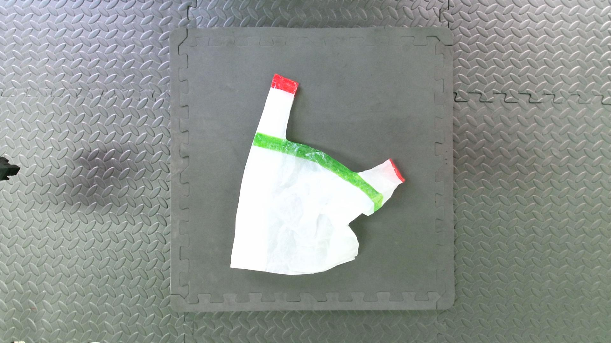
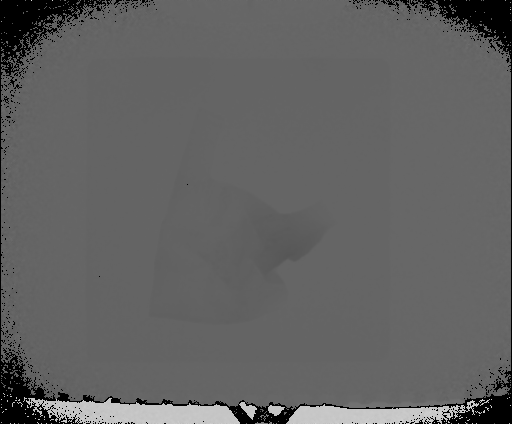
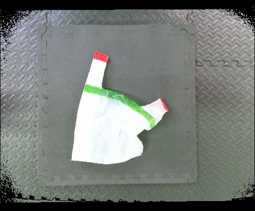
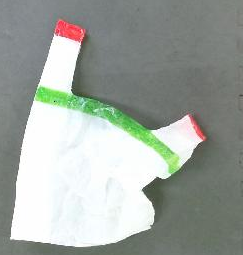
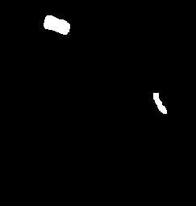
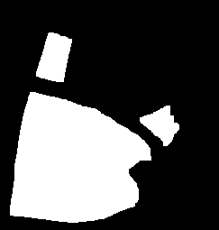
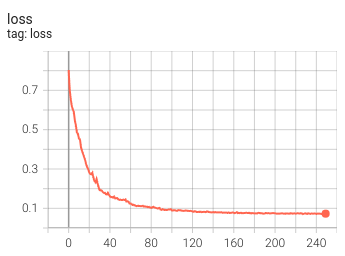
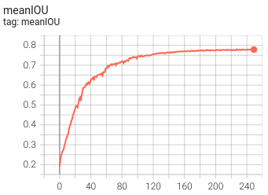

<h1> ShakingBot: Dynamic Manipulation for Bagging</h1>

<div style="text-align: center;">

[Gu Ningquan](https://github.com/happydog-gu), [Zhang Zhizhong](https://github.com/zhangxiaozhier)

Wuhan Textile University,Wu Han,Hu Bei,China
</div>


<div style="margin:50px; text-align: justify;">
Bag manipulation through robots is complex and challenging due to the deformability of the bag.
Based on dynamic manipulation strategy, we propose the ShakingBot for the bagging tasks.
Our approach utilizes a perception module to identify the key region of the plastic bag from arbitrary initial configurations. 
According to the segmentation, ShakingBot iteratively executes a set of actions, including Bag Adjustment, Dual-arm Shaking and One-arm Holding, to open the bag. Then, we insert the items and lift the bag for transport. 
We perform our method on a dual-arm robot and achieve a success rate of 21/33 for inserting at least one item across a variety of initial bag configurations.
In this work, we demonstrate the performance of dynamic shaking actions compared to the quasi-static manipulation in the bagging task.
We also show that our method generalizes to variations despite the bag's size, pattern, and color.
</div>

<br>

This repository contains code for training and evaluating ShakingBot in both simulation and real-world settings on a dual-UR5 robot arm setup for Ubuntu 18.04.
It has been tested on machines with Nvidia GeForce RTX 2080 Ti.

# Table of Contents
- 1 [Data Collection](#data-collection)
    - 1.1 [Explanation](#explanation)
    - 1.2 [Installation](#installation)
    - 1.3 [Show Datasets](#show-datasets)
- 2 [Get Datasets](#get-datasets)
- 3 [Network Training](#network-training)
  - 3.1 [Installation and Code Usage](#installation-and-code-usage)
  - 3.2 [Train ShakingBot](#train-shakingbot)
  - 3.3 [Evaluate ShakingBot](#evaluate-shakingbot)

# Data Collection
Kinect v2 based data collection code
<div align=center>


</div>

## Explanation
- The folder【get_rgb_depth】is used to get the raw data of Kinect V2, RGB image size is 1920×1080,Depth image size of 512×424.
- Since RGB images and depth images have different resolutions, they need to be aligned.The folder【colorized_depth】is used to align images.
- 【final_datasets】is used to processing of images to target resolution,Generate .png and .npy files.
- 【all_tools】Includes hardware kit for matlab to connect to Kinect V2.

## Installation
Requirements
* Ubuntu 18.04
* Matlab R2020a
* Kinect V2

## Show Datasets
<div align=center>

raw_rgb(1920×1080):

  

raw_depth(512×424):

  

align_rgb(512×424):

  
</div>


# Get Datasets
1. preprocess the images collected in kinect v2
    ```
    cd get_datasets
    python get_rgb_npy.py
    ```
<div align=center>

processed_rgb(243×255):


</div>

2. get datasets label
    ```
    python color_dectect.py
    ```
<div align=center>



</div>

# Network Training
## Installation and Code Usage
1. Make a new virtualenv or conda env. For example, if you're using conda envs, run this to make and then activate the environment:
    ```
    conda create -n shakingbot python=3.6 -y
    conda activate shakingbot
    ```
2. Run pip install -r requirements.txt to install dependencies.
    ```
    cd network_training
    pip install -r requirements.txt
    ```

## Train Region Perception Model
1. In the repo's root, get rgb and depth map

2. In the `configs` folder modify `segmentation.json`

3. Train Region Perception model
    ```
        python train.py
    ```


## Evaluate Region Perception Model


<div align=center>


</div>


1. In the repo's root, download the [model weights](https://drive.google.com/file/d/1-BuhIfmZCCvlW4gIxxTCj5XPGdFebea6/view?usp=sharing)


2. Then validate the model from scratch with
    ```
    python visualize.py
    ```
3.  Training details can be viewed in the bag
    ```
    cd network_training
    tensorboard --logdir train_runs/
    ```

