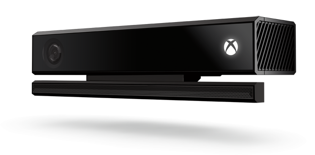
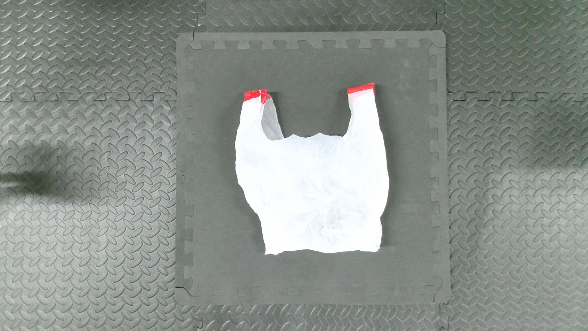
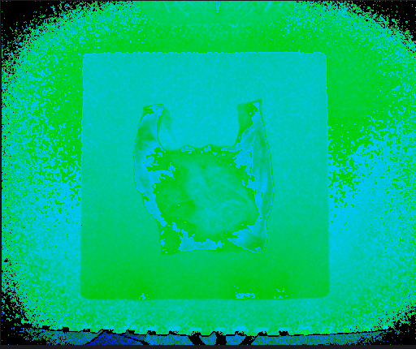
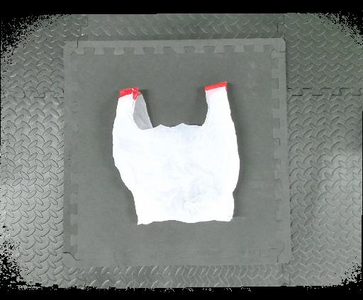
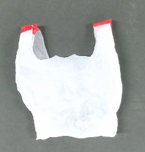

# Data collection for Kinect V2

Kinect v2 based data collection code



# Explanation

- The folder【get_rgb_depth】is used to get the raw data of Kinect V2, RGB image size is 1920×1080,Depth image size of 512×424.
- Since RGB images and depth images have different resolutions, they need to be aligned.The folder【colorized_depth】is used to align images.
- 【final_datasets】is used to processing of images to target resolution,Generate .png and .npy files.
- 【all_tools】Includes hardware kit for matlab to connect to Kinect V2.

# Installation
Requirements
* Windows 10

* Matlab R2020a

* Python 3.6.13

* Kinect V2

  

  1. Make a new virtualenv. For example：

     ```python
     conda create -n kinectV2_env python=3.6 -y
     
     conda acitvate kinectV2_env
     ```

  2. Run :

     ```python
     pip install -r requirements.txt
     ```

  3. get rgb and depth,into folder 【get_rgb_depth】 run `get_rgb_depth.m`

  4. align images, into folder 【colorized_depth】run `main_script.m`
  
  4. processing of images, into folder 【final_datasets】run `python get_rgb_npy.py`
# Show Datasets

- raw_rgb(1920×1080):

  

- raw_depth(512×424):

  

- align_rgb(512×424):

  

- processed_rgb(243×255):

  